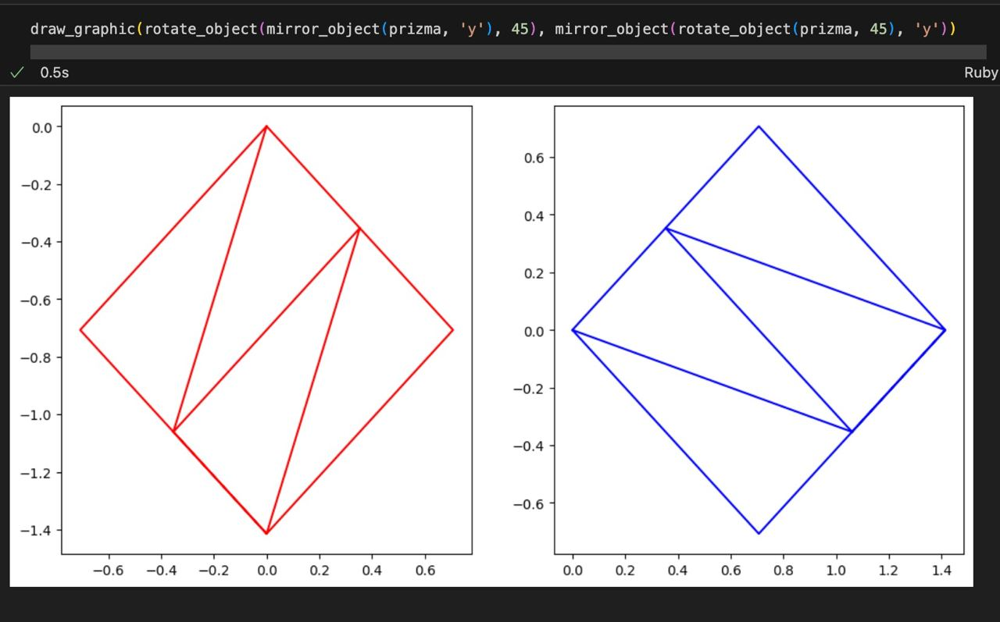

1. Що таке лінійні трансформації? *(0,25 бала)* 
Такі трансформації що зберігають операції додавання векторів та множення на скалаяр ($\phi (a + b) = \phi a + \phi b, \lambda \phi a = \phi \lambda a$)
2. Як і в яких галузях застосовуються лінійні трансформації? *(0,25 бала)* 
Лінійні трансформації використовуються в математиці, фізиці, інформатиці, економіці та інженерії для моделювання і розв'язання задач, пов'язаних із зміною координат, обробкою сигналів, комп'ютерною графікою, машинним навчанням і аналізом даних.
3. Що таке матриця лінійної трансформації та як її можна інтерпретувати? *(0,25 бала)* 
Матриця лінійної трансформації — це матриця, яка представляє лінійну трансформацію у вигляді множення матриці на вектор.
Змінюючи елементи матриці, можна реалізовувати різні лінійні перетворення: обертання, масштабування, зсув тощо.
4. Які особливості та властивості має матриця обертання? *(0,25 бала)* 
Матриця обертання має визначник, рівний 1, і зберігає довжину векторів та кути між ними. Вона ортогональна, тобто її транспонована матриця є оберненою до неї.
5. Чи залежить фінальний результат від порядку трансформацій? Провести експерименти з фігурами або зображеннями з частин 1-2.  *(0,25 бала)* 
Так, порядок лінійних трансформацій важливий. Наприклад, спочатку віддзеркалити, а потім масштабувати дасть інший результат, ніж спочатку масштабувати, а потім віддзеркалити: 

6. Була здійснена якась довільна лінійна трансформація; як знайти матрицю лінійної трансформації, що поверне все до початкового вигляду? Чи завжди можна здійснити обернену трансформацію? *(0,25 бала)*   Щоб знайти матрицю оберненої трансформації, потрібно знайти обернену матрицю до заданої. Обернену трансформацію можна здійснити, якщо визначник матриці трансформації не дорівнює нулю (матриця невироджена).
7. Модуль визначника матриці трансформації менше 1, які висновки можна зробити про дану трансформацію (як змінюється простір при даній трансформації)? А якщо більше 1? Дорівнює 1? Дорівнює 0? *(0,5 бала)*
- Менше 1: Простір стискається.
- Більше 1: Простір розширюється.
- Дорівнює 1: Простір зберігає свій об'єм, трансформація є обертанням, відображенням або комбінацією таких операцій.
- Дорівнює 0: Трансформація вироджує простір, зводячи його до меншої розмірності, наприклад, перетворюючи площину в лінію або точку.